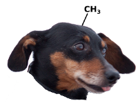

 MethylDackel (formerly named PileOMeth, which was a temporary name derived due to it using a PILEup to extract METHylation metrics) will process a coordinate-sorted and indexed BAM or CRAM file containing some form of BS-seq alignments and extract per-base methylation metrics from them. MethylDackel requires an indexed fasta file containing the reference genome as well.

Prerequisites
=============

A C compiler, such as gcc, htslib (versions 1.4 through 1.9 are known to be compatible) and libBigWig are required. For libBigWig, the static library is used.

Compilation
===========

Compilation and installation can be performed via:

    git clone https://github.com/dpryan79/MethylDackel.git
    cd MethylDackel
    make LIBBIGWIG="/some/path/to/libBigWig.a"
    make install prefix=/some/installation/path

If the linker has issues finding the htslib headers and library, then specify them using `CFLAGS` and `LIBS`:

    make install CFLAGS="-O3 -Wall -I/some/path/include " LIBS="-L/some/path/lib" prefix=/some/installation/path LIBBIGWIG="/some/path/to/libBigWig.a"

License
=======

This software is licensed under the terms of the MIT license (see the LICENSE file). Please feel free to redistribute this according to those terms.

Methylation Context
===================

MethylDackel groups all Cytosines into one of three sequence contexts: [CpG](http://en.wikipedia.org/wiki/CpG_site), CHG, and CHH. Here, H is the IUPAC ambiguity code for any nucleotide other than G. If an N is encountered in the reference sequence, then the context will be assigned to CHG or CHH, as appropriate (e.g., CNG would be categorized as in a CHG context and CNC as in a CHH context). If a Cytosine is close enough to the end of a chromosome/contig such that its context can't be inferred, then it is categorized as CHH (e.g., a Cytosine as the last base of a chromosome is considered as being in a CHH context).

Usage
=====

The most basic usage of MethylDackel is as follows:

    MethylDackel extract reference_genome.fa alignments.bam

This will calculate per-base CpG metrics and output them to `alignments_CpG.bedGraph`, which is a standard bedGraph file with column 4 being the number of reads/read pairs with evidence for a methylated C at a given position and column 5 the equivalent for an unmethylated C. An alternate output filename prefix can be specified with the `-o some_new_prefix` option.

By default, MethylDackel will only calculate metrics for Cytosines in a CpG context, but metrics for those in CHG and CHH contexts are supported as well (see the --CHH and --CHG options). If you would like to ignore Cytosines in CpGs, simply specify --noCpG. Each type of metric is output to a different file. For per-CpG and/or per-CHG rather than per-Cytosine metrics, see "Per-CpG/CHG metrics", below.

MethylDackel can filter reads and bases according to MAPQ and Phred score, respectively. The default minimums are MAPQ >= 10 and Phred >= 5, though these can be changed with the -q and -p options. MethylDackel can also account for methylation bias (described below) with the `--OT`, `--OB`, `--CTOT`, and `--CTOB` options.

Given a bigWig of Bismap mappability data (using the `-M` option), MethylDackel can also filter out reads with a mappability score which is too low to support methylation calling. With default settings, a read would be rejected if less than 15 bases have mappability &ge; 0.01, but this can be configured with the `-t` and `-b` options.

This mappability data can also be read in from a BBM file. A BBM file (short for "Binary BisMap") is a custom compressed version of the data from the bigWig which is used by MethylDackel. It can be read in much faster than a bigWig and takes up less disk space. These files can be created by specifying the `-O` or `-N` options when running MethylDackel extract, and can be read in using the `-B` option (instead of `-M`).

A note on overlapping reads
===========================

A commonly asked and important question is how paired-end reads that overlap are treated. If two mates from a paired-end experiment happen to both overlap the same CpG then one could get skewed results if the methylation status is taken from both reads, rather than only one of them (i.e., double counting paired-end reads is a bad idea). MethylDackel was written with this in mind, so by default paired-end reads that overlap will never be double counted.

It's useful to note how this is implemented internally, since it relates to the `-p` option. For the sake of an example, suppose you have two mates that overlap a given position. In this example, we'll specify that mate #1 has a base call with a phred score of 20 at that position and that mate #2 has a base all with a phred score of 15.

 1. If both base calls agree, then the one with the lower score (here, mate #2 with a score of 15) is set to 0. Further, the other read's base score (here, mate #1 with a score of 20) is increased by 20%. Since the `-p` option defaults to 10, it will skip mate #2 and only count read #1.
 2. If the base calls instead disagree, then the process is more complicated. There are a total of four possibilities for how this could work:
   1. Mate #1 has a higher phred score and the base call is not an `N`. Then its phred score is decremented by that of the other mate (in the example above, `20-15=5`, so `5` would be the new phred score). The phred score for the mate is then set to 0.
   2. Mate #2 has a higher phred score and the base call is not an `N`. In that case the same procedure as that above is followed, with the mate #2 phred score decremented and the mate #1 phred score set to 0.
   3. The mate with the higher phred score has a base call of `N`. In this case, the phred scores for both mates are set to 0.
   4. The mates have identical phred scores. In this case, the phred scores are both set to 0.

It's important to think about the above possibilities in conjunction with the `-p` option. If two mates agree but individually have low quality base calls, they may combine to produce a base call of acceptable quality. Similarly, if the two mates have high quality base calls but these disagree, the result could be a combined base call of low quality (due to the disagreement). This is actually the same prodcedure that `samtools mpileup` uses internally, so if you're familiar with variant calling with `samtools` then the methodology and reasons are identical.

Single Cytosine methylation metrics extraction
==============================================

`MethylDackel extract` produces a variant of [bedGraph](http://genome.ucsc.edu/goldenpath/help/bedgraph.html) that's similar to the "coverage" file produced by [Bismark](http://www.bioinformatics.babraham.ac.uk/projects/bismark/) and [Bison](https://github.com/dpryan79/bison). In short, each line consists of 6 tab separated columns:

1. The chromosome/contig/scaffold name
2. The start coordinate
3. The end coordinate
4. The methylation percentage rounded to an integer
5. The number of alignments/pairs reporting methylated bases
6. The number of alignments/pairs reporting unmethylated bases

All coordinates are 0-based half open, which conforms to the bedGraph definition. When paired-end reads are aligned, it can often occur that their alignments overlap. In such cases, MethylDackel will not count both reads of the pair in its output, as doing so would lead to incorrect downstream statistical results.

An example of the output is below:

    track type="bedGraph" description="SRR1182519.sorted CpG methylation levels"
    1	25115	25116	100	3	0
    1	29336	29337	50	1	1

Note the header line, which starts with "track". The "description" field is used as a label in programs such as [IGV](http://www.broadinstitute.org/igv/). Each of the subsequent lines describe single Cytosines, the 25116th and 29337th base on chromosome 1, respectively. The first position has 3 alignments (or pairs of alignments) indicating methylation and 0 indicating unmethylation (100% methylation) and the second position has 1 alignment each supporting methylation and unmethylation (50% methylation).

Per-CpG/CHG metrics
===================

In many circumstances, it's desireable for metrics from individual Cytosines in a CpG to be merged, producing per-CpG metrics rather than per-Cytosine metrics. This can be accomplished with the `--mergeContext` option in `MethylDackel extract`. If this is used, then this output:

    track type="bedGraph" description="SRR1182519.sorted CpG methylation levels"
    1	25114	25115	66	2	1
    1	25115	25116	100	3	0

is changed to this:

    track type="bedGraph" description="SRR1182519.sorted merged CpG methylation levels"
    1	25114	25116	83	5	1

This also works for CHG-level metrics. If bedGraph files containing per-Cytosine metrics already exist, they can be converted to instead contain per-CpG/CHG metrics with `MethylDackel mergeContext`.

Excluding low-coverage regions
==============================

If your downstream analysis requires an absolute minimum coverage (here, defined as the number of methylation calls kept after filtering for MAPQ, phred score, etc.), you can use the `--minDepth` option to achieve this. By default, `MethylDackel extract` will output all methylation metrics as long as the coverage is at least 1. If you use `--minDepth 10`, then only sites covered at least 10x will be output. This works in conjunction with the `--mergeContext` option, above. So if you request per-CpG context output (i.e., with `--mergeContext`) and `--minDepth 10` then only CpGs with a minimum coverage of 10 will be output.

Logit, fraction, and counts only output
=======================================

The standard output described above can be modified if you supply the `--fraction`, `--counts`, or `--logit` options to `MethylDackel extract`.

The `--fraction` option essentially produces the first 4 columns of the standard output described above. The only other difference is that the range of the 4th column is now between 0 and 1, instead of 0 and 100. Instead of producing a file ending simply in `.bedGraph`, one ending in `.meth.bedGraph` will instead be produced.

The `--counts` option produces the first three columns of the standard output followed by a column of total coverage counts. This last column is equivalent to the sum of the 5th and 6th columns of the standard output. The resulting file ends in `.counts.bedGraph` rather than simply `.bedGraph`.

The `--logit` option produces the first three columns of the standard output followed by the logit transformed methylation fraction. The logit transformation is log(Methylation fraction/(1-Methylation fraction)). Note that log uses base e. Logit transformed methylation values range between +/- infinity, rather than [0,1]. The resulting file ends in `.logit.bedGraph` rather than simply `.bedGraph`.

Note that these options may be combined with `--mergeContext`. However, `MethylDackel mergeContext` can not be used after the fact to combine these.

methylKit-compatible output
===========================

methylKit has its own format, which can be produced with the `--methylKit` option. Merging Cs into CpGs or CHGs is forbidden in this format. Likewise, this option is mutually exclusive with `--logit` et al.

Excluding likely variant sites
==============================

If your samples are not genetically homogenous, it can sometimes be advantageous to exclude likely variant sites from methylation extraction. As an example, since unmethylated Cs are read as Ts, extracting methylation from a position with a C->T mutation will cause incorrect results. In such a case, the opposite strand will have an A rather than a G (in the non-variant case, there would be a G regardless of methylation status). MethylDackel tracks the number of non-Gs on the strand opposite of Cs in the reference sequence. If the fraction of these exceeds the `--maxVariantFrac` option, then that position will be excluded from output. To exclude cases where the `--maxVariantFrac` value is exceeded only due to low coverage, the opposite strand must have a depth of coverage of at least `--minOppositeDepth`. Note that the default value for `--minOppositeDepth` is 0, indicating that the variant site exclusion process is skipped.

Note that if one additionally specifies `--mergeContext`, that a given CpG or CHG will be excluded from output if either of its individual Cs would be excluded given the specified `--minOppositeDepth` and --maxVariantFrac`.

Methylation bias plotting and correction
========================================

In an ideal experiment, we expect that the probability of observing a methylated C is constant across the length of any given read. In practice, however, there are often increases/decreases in observed methylation rate at the ends of reads and/or more global changes. These are termed methylation bias and including such regions in the extracted methylation metrics will result in noisier and less accurate data. For this reason, users are strongly encouraged to make a methylation bias plot. MethylDackel comes with a function for just this purpose:

    MethylDackel mbias reference_genome.fa alignments.sorted.bam output_prefix

That command will create a methylation bias (mbias for short) plot for each of the strands for which there are valid alignments. The command can take almost all of the same options as `MethylDackel extract`, so if you're interested in looking at only a single region or only CHH and CHG metrics then you can do that (run `MethylDackel mbias -h` for the full list of options). The resulting mbias graphs are in SVG format and can be viewed in most modern web browsers:

If you have paired-end data, both reads in the pair will be shown separately, as is the case above. The program will suggest regions for inclusion ("--OT 2,0,0,98" above) and mark them on the plot, if applicable. The format of this output is described in `MethylDackel extract -h`. These suggestions should not be accepted blindly; users are strongly encouraged to have a look for themselves and tweak the actual bounds as appropriate. The lines indicate the average methylation percentage at a given position and the shaded regions the 99.9% confidence interval around it. This is useful in gauging how many methylation calls a given position has relative to its neighbors. Note the spike in methylation at the end of read #2 and the corresponding dip at the beginning of read #1. This is common and these regions can be ignored with the suggested trimming bounds. Note also that the numbers refer to the first and last base that should be included during methylation extraction, not the last and first base to ignore!.

Alignment trimming
==================

In some protocols it is useful to trim X bases from one or both ends of the alignments regardless of their length. To do this, one can use the `--nOT`, `--nOB`, `--nCTOT`, and `-nCTOB` options, which have a format similar to that mentioned for `--OT` et al. above (the only difference being that one specifies a number of bases, rather than the position within each alignment). Thus, to ignore the 5 bases on either end of alignments on the original top (OT) strand, one would specify `--nOT 5,5,5,5`. Thus, it is irrelevant how long each alignment is, the outermost 5 bases will always be ignored. Note that specifying bounds longer than a given alignment (e.g., `--nOT 100,200,300,400` for a pair of 50 base long alignments) will not cause an error.

Ignored alignments
==================

By default, any alignment marked as being secondary (bit 256), having failed QC (bit 512), being a PCR/optical duplicate (bit 1024), or being supplemental (bit 2048) is ignored. This is a reasonable default and should only be changed by expert users. For those needing to change this behaviour, please see the `-F` or `--ignoreFlags` options to both `MethylDackel mbias` and `MethylDackel extract`.

Per-read metrics
================

As of version 0.4.0, MethyDackel provides a `perRead` subcommand that will produce the per-read CpG methylation level. This has been used by [Stamenova et al.](https://doi.org/10.1101/481283) in their Hi-Culfite method. The output is a tab-separated file with the following fields:

 - read name
 - chromosome
 - position
 - CpG methylation (%)
 - number of informative bases.

Fragments longer than 10kb are currently not handled correctly.

Citing MethylDackel
===================

There are no immediate plans for a MethylDackel publication. If you use MethylDackel (or PileOMeth, as it was formerly known) in your research, please simply cite the URL for this repository on github.

